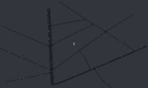
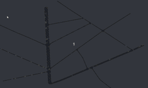

# RL-Traffic-optimization_CIL4sys
An implementation of the traffic simulation optimization with reinforcement learning, with FLOW and SUMO.

# Goal
The aim of this project was to verify the possibility of making road traffic more fluid in a medium-sized city and thus reduce the pollution linked to traffic jams.

For this, the project team relied on SUMO for the simulation of road traffic associated with FLOW libraries, developed by UC Berkeley, and RLlib.

Assuming that the generalization of autonomous vehicles was not yet on the agenda, the team focused on the simple control of traffic lights.

To solve this type of problem, reinforcement learning methods are the most suitable. Indeed, these methods are known to be effective in cases where an agent evolves and interacts in an environment by actions that it chooses. Each action generates an environmental response called a reward (negative or positive) that will take it to a new state. This type of approach is essentially distinguished from conventional approaches to machine learning by the fact that a data set is not available and that this data is not independent and identically distributed.

All of the code is in python.

# Results
In terms of results, we have shown that traffic flow is possible with substantial improvements in terms of waiting time and average speed. On the other hand, in terms of the reduction of greenhouse gases, with the exception of the study of a single crossroads, it is difficult to observe improvements. Undoubtedly because the behavior of the implemented vehicles was a "human" behavior aiming to reach as quickly as possible the maximum authorized speed, after passing to green lights. Adding autonomous vehicles to smoother acceleration in traffic could solve this problem.

### <ins>Results for Issy-les-Moulineaux</ins>
> **Untrained** 

 

> **Trained** 

 

### <ins>Results for a Crossroad</ins>
> **Untrained** 

 

> **Trained** 

# Installation
For library installation, refer to: https://flow.readthedocs.io/en/latest/flow_setup.html#local-installation

In addition, to fully master the simulation and learning environment, it is strongly recommended to follow the FLOW tutorials: https://github.com/flow-project/flow/tree/master/tutorials/

To explore the results given by SUMO in csv format : Etude_csv.ipynb

